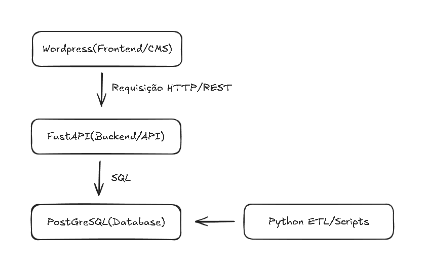

## Informações do Projeto

**Projeto:** Desenvolvimento de Sites Institucionais com um CMS (Content Management System, ou Sistema de Gerenciamento de Conteúdo) Integração de Banco de Dados

**Disciplina:** Laboratório de Desenvolvimento III; 3° Semestre - Banco de Dados - Fatec Bauru 

**Equipe:** 
- Henrique Borges 
- Matheus Nebo  
- Nikolas Pinheiro

## Sobre o projeto

### Visão Geral

O projeto focará em **Entidades Sem Fins Lucrativos e ONGs** que atuam com arrecadação de recursos para famílias em situação vulnerável, especificamente na gestão da cadeia de suprimentos de **Cestas Básicas**. O sistema transita entre um portal institucional (CMS) para captação de doadores e um sistema de controle de inventário e distribuição (Backend/Database).

### Motivação e Justificativa

- **Complexidade de Dados:** Itens alimentícios possuem variáveis críticas como lote e validade. Gerenciar isso em papel ou planilhas requer muito tempo e possui altas chances de redundâncias e erros, automatizar a gestão dos recursos, distribuição e registros otimiza o processo.

- **Unidade de Medida** Padrão: Ao focar em cestas básicas, transformamos doações distintas (arroz, feijão, óleo) em uma métrica de impacto social clara.

- **Transparência:** O doador pode ver na aplicação web tanto a contribuição financeira, quanto a contribuição social que o valor proporcionou, não apenas "recebemos R$ 100", mas "seu valor contribuiu para a montagem de 1 cesta básica que já foi entregue" aumentando a confiabilidade e transparência da ONG.

- **Profissionalização da ONG:** Oferecer à organização uma ferramenta de gestão que vai além do operacional, fornecendo indicadores de impacto social e métricas de desempenho. Com dados confiáveis e organizados, a ONG terá acesso à dados e indicadores que viabilizem parcerias, captação de recursos e planejamento.

## Funcionalidades

O sistema foi projetado para atender às necessidades operacionais de ONGs, oferecendo recursos voltados ao gerenciamento de doações, estoque e distribuição de itens.

### Principais funcionalidades do sistema:

- Cadastro de doadores
- Registro de pessoas físicas e jurídicas, com validações específicas para cada tipo.
- Gerenciamento de doações
- Controle de entradas financeiras e materiais, vinculadas aos respectivos doadores.
- Controle de estoque
- Monitoramento de produtos, quantidades, lotes e datas de validade.
- Cadastro de beneficiários
- Armazenamento estruturado de informações para atendimento e distribuição.
- Distribuição de itens
- Registro das entregas realizadas aos beneficiários.
- Movimentação de estoque
- Histórico de entradas, saídas, perdas e ajustes operacionais.
- Integração entre camadas do sistema
- Comunicação entre frontend, API e banco de dados para garantir fluxo contínuo de informações.
- Visualização institucional via CMS
- Apresentação do projeto e disponibilização de conteúdos por meio do WordPress.
- Base para análises e relatórios
- Estrutura preparada para consultas analíticas, indicadores e futura expansão para dashboards.

## Tecnologias Utilizadas

- **PostgreSQL:** Responsável pelo armazenamento e gerenciamento dos dados. Foi escolhido por sua robustez, suporte a modelagem relacional e recursos avançados de integridade e análise.

- **FastAPI:** Atua como backend e camada de API. Centraliza regras de negócio, validações e comunicação entre o banco de dados e o frontend.

- **Wordpress:** Utilizado como CMS e interface institucional do projeto, permitindo a construção rápida de páginas e integração com a API por meio de requisições HTTP.

- **Docker:** Utilizado para padronização e isolamento dos serviços, garantindo consistência entre ambientes de desenvolvimento, teste e futura implantação.

## Estrutura do Projeto

